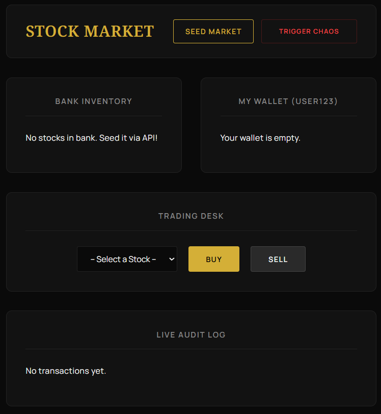

# Simplified Stock Market API

A highly available, containerized REST API simulating a simplified stock exchange. Built with TypeScript, Node.js (Express), Redis, and Nginx.

## Architecture & Technical Decisions

To strictly meet the High Availability (HA) requirements and ensure the application survives the `/chaos` endpoint, this system uses a stateless, multi-container architecture:

1. **Load Balancer (Nginx):** Acts as the single entry point, routing incoming traffic across multiple identical API instances using round-robin load balancing.
2. **API Layer (Node.js/Express):** 3 Replicas of the application run simultaneously. They are completely stateless. If the `/chaos` endpoint kills one instance, Nginx seamlessly routes subsequent requests to the surviving instances, resulting in zero downtime from the user's perspective.
3. **Shared State (Redis):** Because local memory does not survive instance crashes, all state (Bank Inventory, Wallet Balances, Audit Log) is stored in a centralized Redis container. 
4. **Concurrency Control:** Buying and selling stocks inherently creates race conditions. This API utilizes Redis atomic operations (e.g., `HINCRBY`) combined with compensating transactions (reverting state if a balance drops below zero) to guarantee data integrity without complex locking mechanisms.
5. **Frontend Dashboard (React/Vite):** 
A dark-mode, responsive SPA simulating a premium wealth management terminal. It uses Vite's built-in proxy to seamlessly route API requests to the Nginx entry point without triggering Cross-Origin Resource Sharing issues. This completely decouples the UI from the backend.



## Prerequisites

Because this solution is fully containerized, it is OS-agnostic (Windows, macOS, Linux). The only requirement to run the application is:
- **Docker Desktop** (or Docker Engine + Docker Compose)
- **Node.js** (v18+) and **npm** (for the frontend UI)

## Quick Start

You can start the application using the provided one-click startup scripts. The script accepts a single parameter: the **Port** you want the application to be available on.

**For Windows:**
```cmd
.\start.bat 8080
```


**For macOS/Linux**
```cmd
chmod +x start.sh
./start.sh 8080
```

## Start the Frontend Terminal
Open a new terminal window, navigate to the frontend folder, install the dependencies, and start the development server:
```cmd
cd frontend
npm install
npm run dev
```

## Testing High Availability 
This system is designed to survive application crashes. To test this behavior:

1. **Seed the bank:** `POST /stocks` with a body like `{"stocks": [{"name": "TSLA", "quantity": 100}]}`
2. **View the bank:** GET /stocks (Note the successful response).
3. **Trigger a fatal crash:** `POST /chaos` (The process will immediately terminate, returning a 502 error as the connection drops).
4. **View the bank again:** `GET /stocks`. Nginx will instantly route your request to a surviving replica, and you will receive a successful `200 OK` response with intact data retrieved from Redis.

Or you can test this behavior directly from the UI or via the API:
1. **Seed the bank**: Click the "Seed Market" button in the UI.

2. **Execute Trades:** Buy and sell a few stocks to verify the system is working and the database is active.

3. **Trigger a fatal crash:** Click the "Trigger Chaos" button. The backend process handling that specific request will instantly terminate.

4. **Observe the Failover:** Continue clicking "Buy" or "Sell". Nginx will instantly route your request to a surviving replica. Your trades will continue to execute perfectly, and you will receive successful responses with your data fully intact from Redis.

## API Reference

| Method | Endpoint | Description |
| :--- | :--- | :--- |
| `POST` | `/stocks` | Sets the state of the bank. Body: `{"stocks": [{"name": "AAPL", "quantity": 100}]}` |
| `GET` | `/stocks` | Returns the current state of the bank. |
| `POST` | `/wallets/{id}/stocks/{name}` | Simulates a buy or sell operation. Body: `{"type": "buy"}` or `{"type": "sell"}` |
| `GET` | `/wallets/{id}` | Returns the current state of a specific wallet. |
| `GET` | `/wallets/{id}/stocks/{name}` | Returns the quantity of a specific stock in a specific wallet as a raw number. |
| `GET` | `/log` | Returns the entire audit log of successful wallet transactions in order of occurrence. |
| `POST` | `/chaos` | Immediately terminates the process handling the request to simulate a system failure. |